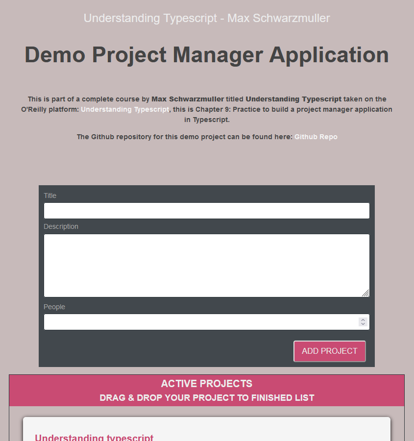

# TABLE OF CONTENTS

[Project Title](#project-title) 
[Description](#description) 
[Usage](#usage) 
[Testing the Application](#testing-the-application) 
[Snapshots](#snapshots) 
[Github](#github) 
[LinkedIn](#linkedin) 
[Questions](#questions) 
[Licence](#licence)

## Project Title

Demo Project Manager Application

## Description

This is part of a complete course by Max Schwarzmuller titled Understanding Typescript taken on the O'Reilly platform: Understanding Typescript, this is Chapter 9: Practice to build a project manager application in Typescript.

## Usage

Enter a title, description and number of people working in your project in the form provided and click on the ADD PROJECT button to submit the project.

Your project will be added to the ACTIVE PROJECTS list, once you have completed your project, you can drag and drop it , in to FINISHED PROJECTS list.

## Testing the Application

Test the validation for this project by leaving any of the inputs empty or entering less than five characters and a modal will show indicating incorrect inputs.

## Snapshots

## Github

[Github](https://github.com/Sho-ayb)

## LinkedIn

[LinkedIn](https://www.linkedin.com/in/shoaybchoudhry/)

## Questions

sho.ayb@outlook.com

## Licence

MIT License

Please click on the badge for more details on the licence.

